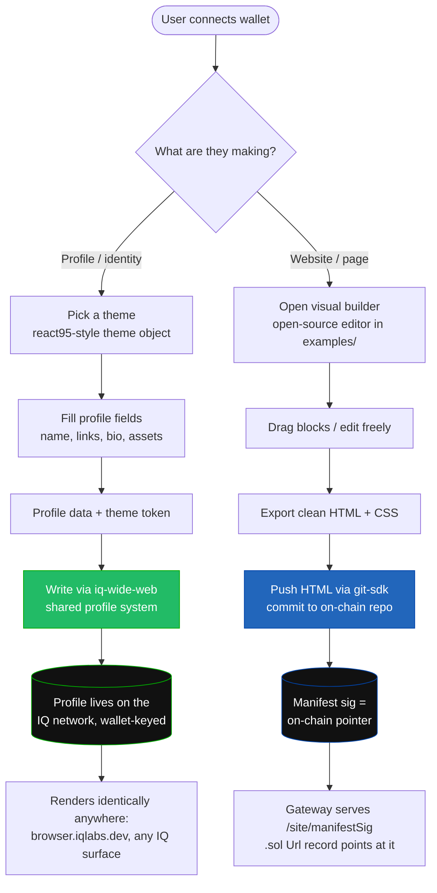
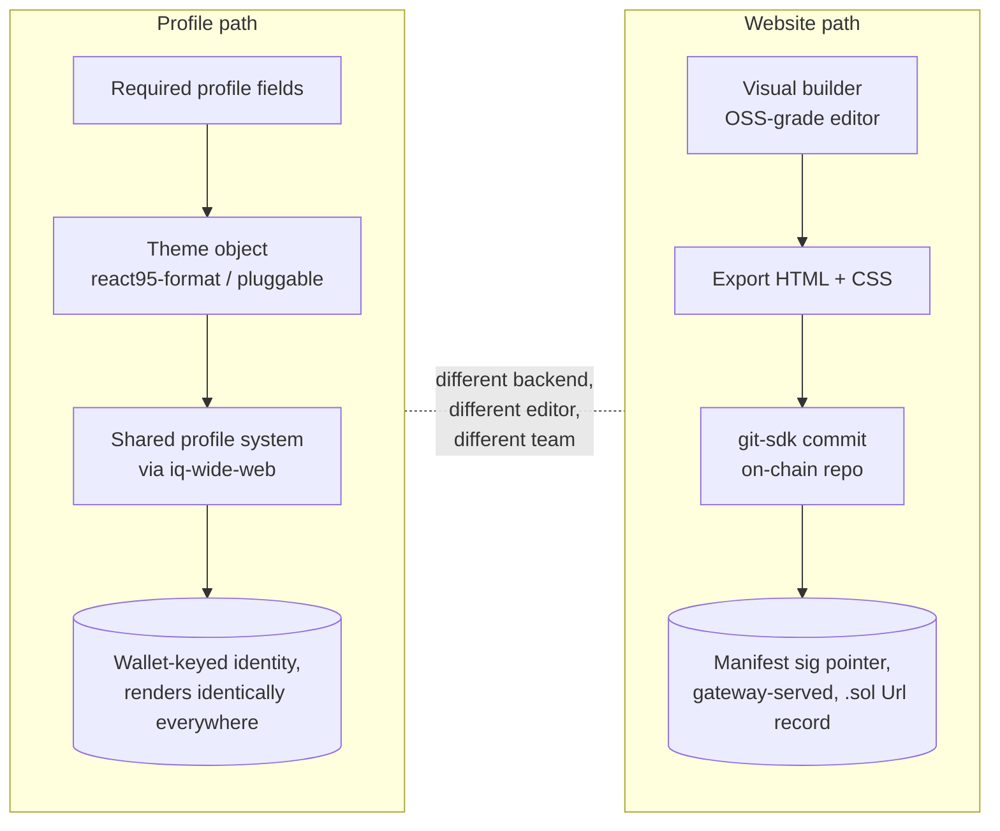

# IQForge — Direction Notes (from Zo)

First: the overall idea here is genuinely good. Template-first, schema-driven, "edit
a template → publish on-chain → point a `.sol` at it" is the right product shape, and
the separation of read layer / write layer / single SDK integration point is clean.
The notes below are about **how the two halves should diverge**, not a rewrite. There
are two distinct products hiding in this repo, and they want different backends and
different editors.

> Context note (not a criticism of the work): this first version was put together by
> someone who hadn't coded before, so some of the wiring is aspirational. Treat the
> stubs as intent, not as finished integration.

---

## The one diagram that matters

The current repo treats "profile" and "website" as the same thing: an 18-template
gallery, one customizer, one publish pipeline. They should split. A **profile** is
identity that belongs to the IQ network and renders the *same everywhere*. A
**website** is an arbitrary page the user authors and owns. Different storage, different
editor, different team.



Key idea: **the profile half is a thin client over a shared system; the website half is
a real builder + a real on-chain git push.** Don't make them the same pipeline.

---

## 0. Stop hand-rolling the chain layer — use the published SDKs

The README still says "GitHub" in places and the SDK is stubbed in
[lib/iqlabs.ts](lib/iqlabs.ts). There's a published package that does the on-chain git
part for us — install it, read its README, and use the entry that fits:

```
npm install @iqlabs-official/git-sdk
```

It exposes three subpath entries (pick by environment):

| Import | Use when |
|---|---|
| `@iqlabs-official/git-sdk/browser` | dApp / this Next.js app — installs SubtleCrypto SHA-256 |
| `@iqlabs-official/git-sdk/node`    | CLI / scripts / server tooling |
| `@iqlabs-official/git-sdk`         | types + pure functions only |

In the browser, it takes a wallet-adapter signer directly — exactly the shape we already
have from `useWallet()`:

```ts
import { GitClient, readRegistryPage } from "@iqlabs-official/git-sdk/browser";
import { useConnection, useWallet } from "@solana/wallet-adapter-react";

const { connection } = useConnection();
const wallet = useWallet();

const client = new GitClient({
  connection,
  signer: {
    publicKey: wallet.publicKey!,
    signTransaction: wallet.signTransaction!,
    signAllTransactions: wallet.signAllTransactions!,
  },
});

await client.createRepo({ name: "my-site", description: "", isPublic: true, timestamp: Date.now() });
await client.commit("my-site", "publish", scan); // blob/tree uploads forward to writer.codeIn
```

`GitClient` gives us `createRepo / commit / checkout / clone / log / status`, plus
`readLatestCommit`, `loadTree`, `loadBlob`. That's the entire website-publish backend —
we don't write the codeIn/manifest dance by hand. The README is the source of truth;
have it open while wiring.

---

## 1. Profiles — go through iq-wide-web, not a local template

Profiles should **not** be one of the 18 local templates. A profile is network identity,
and the canonical home for it is [iq-wide-web](https://github.com/IQCoreTeam/iq-wide-web)
— the Solana-native browser that already resolves a wallet to a profile page and absorbs
`iqprofile.net`. If IQForge writes profiles its own way, we get two incompatible profile
formats. Instead: **IQForge becomes a nice editor that writes into the same profile system
iq-wide-web reads from.** One source of truth, rendered identically on every IQ surface.

What a profile needs is small: the required profile info (name, handle, links, bio,
assets) **plus a theme**. Today the IQ profile is "required info + the react95 library".
react95 is the right instinct, because **react95 already has a theme-generation system** —
a theme is just a flat object of named color tokens. So the profile contract should be:

```
profile = { ...profileData, theme }
```

and `theme` follows a known, swappable format.

### Theme format: follow react95's shape

A react95 theme is a flat record of color tokens. This is the **actual `original.ts`**
theme from the library — copy this shape:

```ts
// react95 theme — every key is a color string
export default {
  name: 'original',

  anchor: '#1034a6',
  anchorVisited: '#440381',
  borderDark: '#848584',
  borderDarkest: '#0a0a0a',
  borderLight: '#dfdfdf',
  borderLightest: '#fefefe',
  canvas: '#ffffff',
  canvasText: '#0a0a0a',
  canvasTextDisabled: '#848584',
  canvasTextInvert: '#fefefe',
  checkmark: '#0a0a0a',
  desktopBackground: '#008080',
  flatDark: '#9e9e9e',
  flatLight: '#d8d8d8',
  focusSecondary: '#fefe03',
  headerBackground: '#060084',
  headerText: '#fefefe',
  hoverBackground: '#060084',
  material: '#c6c6c6',
  materialDark: '#9a9e9c',
  materialText: '#0a0a0a',
  progress: '#060084',
  tooltip: '#fefbcc'
} as Theme;
```

Applied via `ThemeProvider`:

```ts
import original from 'react95/dist/themes/original';
<ThemeProvider theme={original}>{/* profile UI */}</ThemeProvider>
```

So the profile contract becomes literally:

```
format: react95 theme  →  theme: <a react95 theme object, in the shape above>
```

### Supporting other component libraries' themes too

We don't have to be react95-only. The same "profile = data + theme object" contract
generalizes: any React UI library that takes a theme object can be a renderer, as long as
we record which library + the theme in its native shape. The contract reads:

```
format: <legit theme library>  →  theme: <that library's theme format>
```

Examples of the pattern:

```
format: react95            →  theme: { name, anchor, canvas, material, headerBackground, ... }   (flat color tokens)
format: <MUI-like lib>     →  theme: { palette: { primary: {...}, background: {...} }, typography: {...} }
format: <Chakra-like lib>  →  theme: { colors: {...}, fonts: {...}, components: {...} }
```

The profile system stores `{ library, theme }`; the renderer on iq-wide-web picks the
matching provider. New look = new theme object, zero new profile code — the same
"templates are data, not code" principle this repo already nails, applied to *themes*.

### We can also build our own theme-able UI lib (vibe-coded)

react95 proves the model: a component set + a flat theme token object. Nothing stops us
from vibe-coding **our own** react95-style UI library — same theming contract (a flat,
named token object + a `ThemeProvider`) — and shipping a few genuinely *legit* themes of
our own as first-class profile looks. That gives IQ profiles a distinct, ownable
aesthetic while staying compatible with the "format → theme" contract above.

---

## 2. Websites — the export-and-push flow is right; bring a real editor

The website half is already on the right track: **render a correct HTML document and push
it.** [lib/export-html.ts](lib/export-html.ts) builds a self-contained `index.html`, and
the publish flow points a `.sol` `Url` record at the manifest sig. Good plan — keep it.
Swap the by-hand codeIn for `git-sdk` (§0), and the website backend is basically done.

The missing piece is the **editor**. Hand-building a visual website builder is a huge lift
and not where our effort should go. Instead: **pull a good open-source builder into an
`examples/` folder, study it, and have our AI build our editor to match** — same caliber
of code, generating sites the same way, rendered in our own edit screen.

### Plan: clone MIT-licensed builders into `examples/`

Make an `examples/` folder and pull MIT-licensed open-source website builders to learn
from. Search terms to start with (and feel free to branch out):

- `GrapesJS React website builder`
- `GrapesJS custom blocks`
- `GrapesJS save load project JSON`
- `GrapesJS export html css`
- `Craft.js React page builder`
- `Puck visual editor React`

(Check each one's license — pull the **MIT** ones.) GrapesJS is the obvious anchor: it has
custom blocks, JSON save/load, and native HTML/CSS export — which lines up exactly with
our "edit → export clean HTML → push" pipeline. Craft.js and Puck are React-native
alternatives worth comparing for how they model the editor state.

The deliverable from this phase isn't "adopt library X" — it's: study how these editors
structure blocks, persist a project as JSON, and emit final HTML/CSS, then have our AI
reproduce that quality in our own edit screen so our builder outputs sites the same way a
great open-source builder does.

---

## 3. How the two structures differ (summary)



| | Profile | Website |
|---|---|---|
| **What it is** | Network identity, wallet-keyed | An arbitrary page the user authors |
| **Editor** | Field form + theme picker | Visual drag-and-drop builder (OSS-grade) |
| **Look** | A `theme` object (react95-format, pluggable) | Whatever the builder produces |
| **Backend** | Shared system via **iq-wide-web** | **git-sdk** commit → on-chain repo |
| **Rendered** | Identically on every IQ surface | Gateway serves `/site/{manifestSig}` |
| **Source of truth** | The IQ profile system | The on-chain git repo |

---

## TL;DR action list

1. `npm install @iqlabs-official/git-sdk`; replace the stub in
   [lib/iqlabs.ts](lib/iqlabs.ts) with `GitClient` (`/browser` entry). Fix the README
   line that still says "GitHub".
2. Split **profile** out of the 18-template gallery. Make it `{ profileData, theme }`,
   theme in **react95 format**, written through the **iq-wide-web** profile system so
   it's the same identity everywhere.
3. Keep the website **export-HTML-and-push** flow; back it with **git-sdk**.
4. Create `examples/`, pull **MIT** open-source builders (GrapesJS / Craft.js / Puck),
   study them, and have our AI build our editor to that standard.
5. (Optional, fun) vibe-code our own react95-style themeable UI lib with a few legit
   first-class IQ themes.
